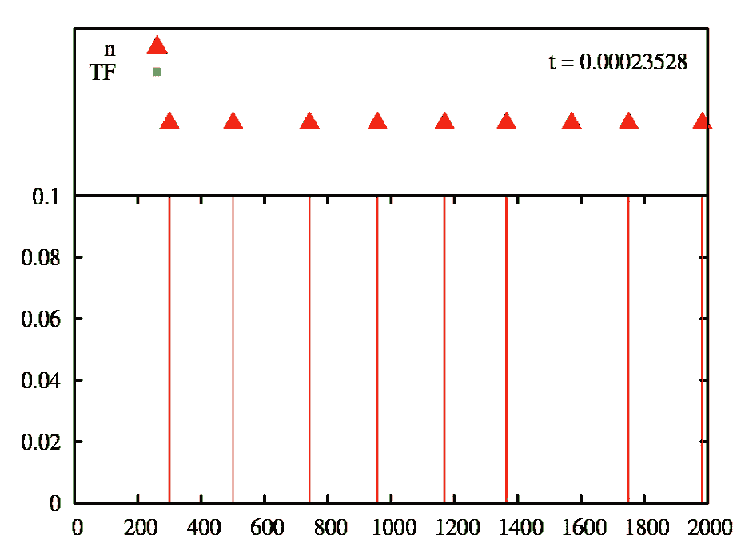
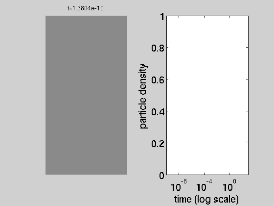
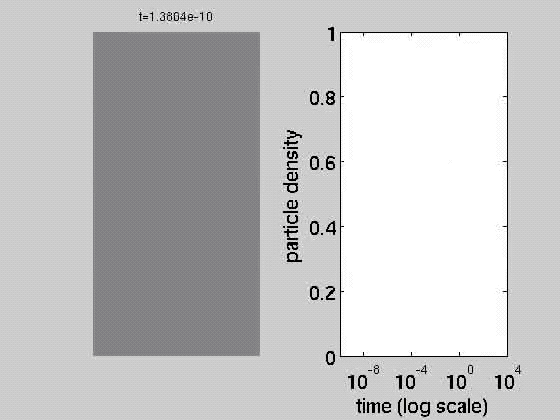

This repository contains all of the necessary files to run the simulation of interacting 1-D particles, as implemented in some of my publications. The initialism is intended to refer to the [G]illepsie [A]lgorithm implementation, in the [G]rand [C]anonical ensemble. 
For the deterministic mean-field equations using ODE time evolution, please see the accompanying repository: https://github.com/Blosberg/meanfield_void_numerics

An example simulation from this software is illustrated in the gif below; here we see red, triangular particles representing nucleosomes, and green squares, representing (smaller) transcription factors adsorbing on a simplified promoter region: 

 

In the above, nucleosomes are inhibited from binding in the NFR (100-200), and preferentially admitted to binding in the +1 region ( quasi-specifically bound near x~300), while TFs are preferentially bound in two arbitrarily chosen locations. Statistical positioning thereafter produces the familiar oscillatory pattern of nucleosome occupancy. A histogram of the time spent in each location is shown below this region, while time progresses on a logarithmic scale.

The code-base itself can handle a much broader range of activity (e.g. active remodelling enzymes that grab and move particles around; arbitrary interaction potentials between neighbouring particles of different species; non-uniform energetic landscape effects, etc.). These features are turned off by default, but can easily be reactivated. Another version of this simulation was also developped for adsorption/desorption on 2D surfaces (see below).

This code was written for my doctoral dissertation and was not originally intended to be made public. I stand by the scientific soundness of the results it produces, but cosmetically speaking, it may not always conform strictly to standard style guides. 
There are several outstanding applications I can think of for this work (see below), and if you would like to use this code for research purposes, please contact me, and I will try to be as helpful as possible. 
Depending on the relative significance of the code, or other input, I might just ask for a citation to [the corresponding paper]( https://journals.aps.org/prl/abstract/10.1103/PhysRevLett.115.088301 ), an acknowledgement, or a chance to join in an active collaboration. Just get in touch, and I'm sure we can find some fair way to allocate appropriate credit for everyone's work. 

# Installation:

- To use this software, first clone this repository to your local machine, and then make sure that the [GNU Scientific Library](https://www.gnu.org/software/gsl/) (GSL) is installed on your machine, and accessible on your "include" paths. You may need to adapt the Makefile that comes with this repo; I've tried to include paths to default directories for Homebrew. 

- Then, go to the repo directory on your machine and type `make `. If you're doing this on an OSX machine, you will likely get a compiler-dependent warning about dynamic vector sizing that you can safely ignore. On linux machines it should install smoothly.

- To run it, you should copy three files into your "Execution" directory (in the repo there's a folder called `test/`). This is where all the data will come out, and I find it cleaner to keep it separate from the other scripts. The three files that you will need to copy there are (1) the executable `GA_GC_N.x`, (2) the input file `GA_GC_N.in`, and (3) the seed for the random number generator `rngSEED.in`. Then navigate to your Execution directory and enter the following command, with 4 command line arguments:

` $ ./GA_GC_N.x  [NGtype]  [TASKID]  [muN] [eps]`

`[NGtype]` should have a value of either "HNG", "SNG", or "LNG", and describes the type of energetic interaction between neighbouring particles: "HNG" stands for "hard-core nucleosome gas" (i.e. mutual-exclusion), "SNG" stands for "soft-core nucleosome gas" (which implements the potential as described in https://www.pnas.org/content/110/14/5719), and "LNG" implements the "linear" potential, where interaction is directly proportional to proximity. Note: at some point in the project, the "SNG" label was used as a "stand-in" for the Lennard-Jones potential (since the SNG potential was not actually used in the PRL paper). Selection for this option was determined by a boolean `LJ` in the header file `code_repository/bren_lib.h` defined at compile time. 

`[TASKID]` should just be set to 1 in this case; this variable is used for batch submission on SGE clusters, so that different runs can implement different parameters.

`[muN]` provides the binding affinity of particles ("nucleosomes"), which can be realistically set to something around 12 for now.

`[eps]` describes the "stiffness" of particles, and is only relevant in the cases of "SNG" and "LNG". In the limit of infinite stiffness, the particles behave like "HNG" particles. See PRL for precise definition; a regime around where interesting dynamics take place would be in the range of `eps=20-25`, if `muN` is set to around 20. Again see PRL for ranges. 

In addition to the above arguments, various parameters (usually more constant) are defined in the input file. We can roughly list them as they are commented on in the main .cpp file:

```
kS_N  ; kA_N;  //--- intrinsic rate of sliding, adsorption for the primary species ("nucleosomes")
Llim  ;  	//--- Size of the lattice in lattice sites, (after Coarse-graining), not necesarily == bp.
t0   ; tf ;  t_trans ; dt_obs  //--- timepoints over which we look at the filling profile: start, finish; "transient" period after which we start assessing equilibrium properties, and dt_obs spacing in between.

footprint ;	//--- size of particles on lattice. In the HNG case, we just take 'w' to mean 'k'

krm_b                 ; krm_val;  // remodelling: boolean (should it be done at all?), and then with what rate.
should_plot_snapshots ; Nplots2makeshort  ; Nplots2makelong; // plot distribution of gap sizes over the course of the process? if so how many.
should_plot_kymo      ; Nplots2make_kymo; // plot kymograph? how finely resolved (See PNAS)
BZcond                ; BZalpha;          // Application of Bolzmann condition to impose detailed balance. See PRL supplemental materials

output_folder;  // Some descriptive prefix name you would like to use for the output folder for this data set
paritycheck;    // Dummy variable; always = 88885888. If any other value is read in for this variable, an error flag is triggered, indicating that some formatting error has been committed while reading in variables (in case you missed a value, or added too many).

numtrials;      // Number of times to repeat the whole simulation up to time tf. Larger numbers here means longer calculation time, but better averaging.
```

# OUTPUT

Once the run is complete, a subdirectory using a name from the input file, and the input parameters will be created with various output results:
In particular, the "filling.." file shows two columns of density vs. time -- I recommend you plot time on a logarithmic scale.
Various other plots describe the profiles of gap-distribution between particles at various time points; the KL entropy; the 2-particle correlation between sizes of neighbouring gaps, and the overall frequency of occupation. For more details please get in touch.

# Applications:

The most obvious remaining applications of this work are essentially unfinished projects described in my thesis. [Chapter 3](https://github.com/Blosberg/GA_GC/blob/master/BO_thesis_chap3.pdf) considers the interactions of two different species of interacting particles (such as, for example, nucleosomes and transcription factors), while [chapter 4](https://github.com/Blosberg/GA_GC/blob/master/BO_thesis_chap4.pdf) outlines the problem of inferring the underlying energetic landscape of a substrate for particle binding, given only the binding density, and a putative neighbour interaction. A final potential application concerns the correlation of neighbouring void-sizes in time.
In all cases, there are preliminary results, but not yet enough for final publication. I have since moved on to other work, and my current funding arrangement would not permit me to finish projects like this on my own.

# Surface Adsorption (2D)

If the above is of interest to you; I have also expanded the same principle to adsorption on 2D surfaces. The dynamics of jamming and reorganization here follow a similar set of principles, and have a much broader set of applications. The dependence of density curves on softness even has a potential biological application in the adsorption of fibrinogen proteins (see Brash, ten Hove, Thrombosis and Haemostasis 51(3):326-30).

Examples of the filling process for hard exclusive particles is shown below:
 
 

Naturally, the dynamics become much more interesting when soft-interactions are allowed, as the same algorithm has shown. This is as-yet unpublished work, however, and I'm looking for collaborations/support to finish this work, and others mentioned above. If you're interested, please get in touch. 
